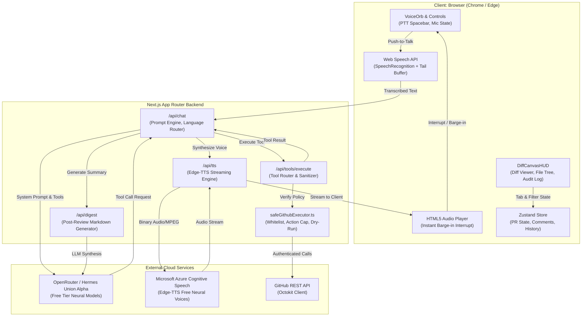
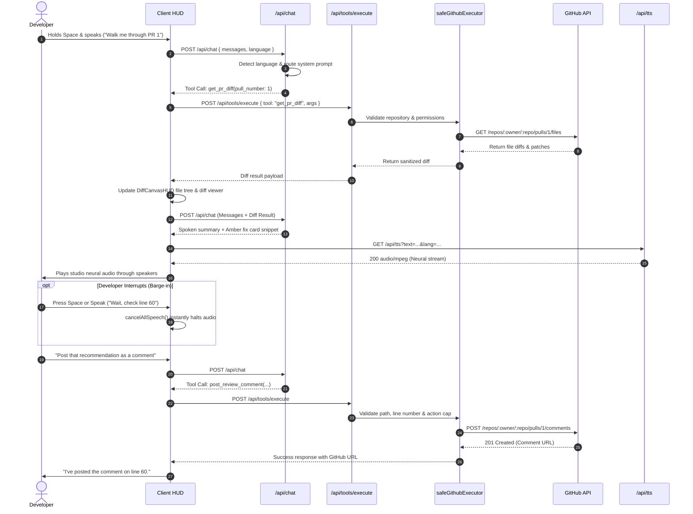

# CodeCast 🎙️⚡

> **Voice-Native GitHub Pull Request Review Copilot**  
> Review, discuss, and comment on pull requests hands-free with low-latency voice, studio-grade neural speech, interactive diff canvas, and safe GitHub tool execution.

[](https://www.typescriptlang.org/)
[](https://nextjs.org/)
[]()
[]()
[]()

---

## 💡 Overview

Reviewing large pull requests by clicking through endless files and typing inline suggestions is slow and tiring. **CodeCast** transforms pull request reviews into a natural conversation:

1. **Speak Naturally**: Hold `Space` (Push-to-Talk) or use continuous voice to explore diffs, question logic, and check edge cases.
2. **Instant Neural Speech**: The assistant speaks in studio-quality neural voices ($0 cost via Edge-TTS) with zero robotic speech artifacts.
3. **Instant Barge-In**: Interrupt the assistant at any millisecond by speaking or tapping `Space`—audio playback halts instantly without buffering lag.
4. **Real GitHub Tool Execution**: Inspect diffs, validate files, post inline code review comments, and submit official reviews directly to GitHub.
5. **Enterprise Safety & Dry-Run**: Hardened executor with repository whitelisting, action caps, duplicate guards, and secret isolation.
6. **Multi-Language Native**: Full auto-detection and fluent review in **English**, **Thai 🇹🇭**, **Japanese 🇯🇵**, and **Spanish 🇪🇸**.

---

## 🏛️ System Architecture



---

## 🔄 Voice & Tool Calling Interaction Loop



---

## 🌐 Studio Neural Voice Pipeline (100% Free)

CodeCast replaces robotic browser voices with Microsoft Azure Cognitive Speech neural voices via `@seepine/edge-tts` with **$0 API fees, no subscriptions, and zero credit exhaustion limits**:

| Language | Default Neural Voice | Secondary Voice | Acoustic & Linguistic Profile |
| :--- | :--- | :--- | :--- |
| **English (`en-US`)** 🇺🇸 | **`en-US-JennyNeural`** | `en-US-GuyNeural` | Studio-grade prosody, natural breath pauses, handles technical code heteronyms without pitch drift. |
| **Thai (`th-TH`)** 🇹🇭 | **`th-TH-PremwadeeNeural`** | `th-TH-NiwatNeural` | Flawless 5-tone contour precision; smooth code-switching for dev terms (`PR`, `diff`, `await`). |
| **Japanese (`ja-JP`)** 🇯🇵 | **`ja-JP-NanamiNeural`** | `ja-JP-KeitaNeural` | Natural pitch accent, authentic peer-developer register, zero robotic sibilance. |
| **Spanish (`es-ES`)** 🇪🇸 | **`es-ES-ElviraNeural`** | `es-ES-AlvaroNeural` | Crisp, natural conversational cadence for European and Latin American technical terms. |

---

## 🛡️ Security & Enterprise Guardrails

Every mutation against GitHub is guarded by [`safeGithubExecutor.ts`](file:///home/nawxtz/Desktop/Hackathons_Competitions_2026/Solo_Events/AssemblyAI%20-%20Voice%20Agent%20Hackathon/Project/codecast/lib/safeGithubExecutor.ts):

* **Backend Secret Isolation**: `GITHUB_PAT` and `OPENROUTER_API_KEY` reside strictly on the server (`process.env`) and are never exposed to client-side code.
* **Dry-Run Mode by Default**: `CODECAST_LIVE_WRITES=false` simulates write actions, previews payloads, and logs them in the HUD Audit Log without touching GitHub.
* **Repository Whitelisting**: Strict checks ensure the agent only interacts with the explicitly authorized repository (`CODECAST_REPO_OWNER`/`CODECAST_REPO_NAME`).
* **Duplicate Comment Prevention**: Automatically hashes file paths and line numbers to prevent duplicate comments on the same line.
* **Action Cap**: Caps write operations to 8 actions per session to prevent accidental loops or spam.
* **Audit Signature Prefix**: All posted comments are prepended with `🎙️ CodeCast (AI Voice Review):` for complete provenance and team transparency.

---

## 🚀 Quickstart

### 1. Prerequisites
* **Node.js**: v20+ or v24+
* **npm** or **pnpm**
* **GitHub Personal Access Token (PAT)**: Scoped to your target repository (`Pull requests: Read & Write`, `Contents: Read-only`).
* **OpenRouter API Key**: Free tier access (`sk-or-...`).

### 2. Installation
```bash
# Clone the repository
git clone https://github.com/Nawxtz/codecast.git
cd codecast

# Install dependencies
npm install
```

### 3. Environment Configuration
Create a `.env.local` file based on `.env.example`:
```env
# OpenRouter API Configuration
OPENROUTER_API_KEY=sk-or-v1-your-key-here
OPENROUTER_MODEL=openrouter/free

# Target GitHub Repository
GITHUB_PAT=ghp_your_github_token_here
CODECAST_REPO_OWNER=Nawxtz
CODECAST_REPO_NAME=codecast-demo

# Safety: Set to true only when you want comments to publish to GitHub
CODECAST_LIVE_WRITES=false

# App URL
NEXT_PUBLIC_APP_URL=http://localhost:3000
```

### 4. Run Development Server
```bash
npm run dev
```
Open [http://localhost:3000](http://localhost:3000) in your browser.

---

## 🧪 Testing & Verification

CodeCast includes a comprehensive automated test suite:

```bash
# Run TypeScript strict typecheck (0 errors)
npm run typecheck

# Run Vitest unit & integration test suite (114 tests)
npm test

# Run Next.js production build
npm run build
```

---

## 🎬 90-Second Demo Flow

| Time | Action | Voice Command / Interaction | What Happens |
| :--- | :--- | :--- | :--- |
| **0:00** | Open App | Navigate to `http://localhost:3000` | HUD loads PR #1 diff automatically. |
| **0:15** | Walkthrough | Hold Space: *"Cast, walk me through PR 1."* | AI reviews diff, explains coupon validation, speaks concise 1-sentence summary. |
| **0:30** | Fix Card | Inspect Sidebar | Amber recommendation card appears with line `src/checkout.ts:60` and clean code fix. |
| **0:45** | Barge-in | Press Space while AI speaks: *"Wait, line 60!"* | Instant audio cutoff. Agent stops speaking immediately. |
| **1:00** | Post Comment | *"Post that recommendation as an inline comment."* | Real inline GitHub comment is created via `safeGithubExecutor`. |
| **1:15** | Submit Review | *"Submit the review requesting changes."* | Official GitHub PR review submitted with `REQUEST_CHANGES` status. |
| **1:30** | Review Digest | Switch to **Digest** tab | Post-session markdown summary ready for Slack/Jira. |

---

## 📂 Project Structure

```text
codecast/
├── app/
│   ├── api/
│   │   ├── chat/route.ts         # LLM prompt, auto-detection, tool dispatch
│   │   ├── digest/route.ts       # Post-review markdown digest generator
│   │   ├── tools/execute/route.ts # Safe GitHub tool executor endpoint
│   │   └── tts/route.ts          # Edge-TTS neural voice streaming
│   ├── globals.css               # Linear/Vercel minimalist theme
│   ├── layout.tsx                # App root layout & metadata
│   └── page.tsx                  # Application entry point
├── components/
│   ├── DiffCanvasHUD.tsx         # Unified review HUD (Diff, File Tree, Audit Log)
│   ├── DiffViewer.tsx            # Line-by-line diff viewer with comment anchors
│   ├── FixRecommendationCard.tsx # Amber recommendation cards for code fixes
│   └── VoiceOrb.tsx              # Animated SVG voice orb with listening/speaking states
├── lib/
│   ├── githubClient.ts           # Octokit client for reading diffs & files
│   ├── safeGithubExecutor.ts     # Whitelist, dry-run, action cap, deduplication
│   ├── digestService.ts          # Post-review digest synthesis service
│   ├── types.ts                  # Shared TypeScript interfaces & types
│   ├── language/
│   │   └── detector.ts           # Multilingual heuristics & tag extractors
│   └── voice/
│       ├── speechRecognition.ts  # Web Speech API wrapper with tail buffer
│       ├── speechSynthesis.ts    # Edge-TTS streaming audio player & barge-in
│       └── useVoiceSession.ts    # Main voice session hook & turn-taking state
├── docs/                         # Specification, PRD, architecture, security docs
├── scripts/                      # Seed, reset, and verification scripts
└── tests/                        # Vitest test suite (114 unit & route tests)
```

---

## 📄 License

MIT © [Nawxtz](https://github.com/Nawxtz)
