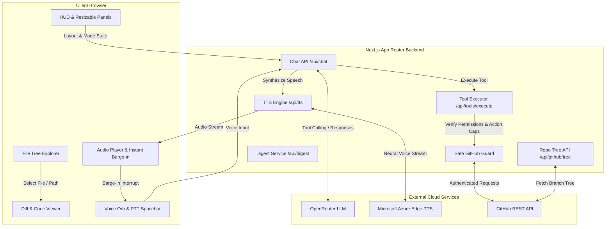
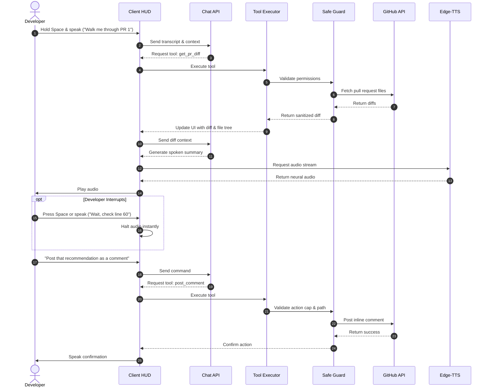

# CodeCast

> **Voice-Native GitHub Pull Request Review & Codebase Copilot**  
> Review, explore, and discuss pull requests and entire repositories hands-free with low-latency voice, studio-grade neural speech, interactive diff canvas, recursive file tree explorer, and safe GitHub tool execution.

[](https://www.typescriptlang.org/)
[](https://nextjs.org/)
[]()
[]()
[]()

---

## Overview

Reviewing pull requests or understanding unfamiliar codebases by clicking through endless files and typing inline suggestions is slow and tiring. CodeCast transforms pull request reviews and codebase exploration into a natural conversation:

- **Dual GitHub Modes**:
  - **🐙 GitHub PR**: Inspect live pull request diffs, highlight line-by-line changes, discuss logic, and post official review comments.
  - **🌐 GitHub Repo**: Explore entire repository directory trees across any branch (🌿 main), browse code files, and ask architectural questions.
- **IDE-Style Resizable Workspace**: Multi-panel workspace with draggable splitters (col-resize), drag-to-collapse (pulling past threshold snaps panels shut into margin strips), and instant restore controls via edge tabs and header toggles.
- **Interactive File Tree Explorer**: VS Code / Cursor-style recursive file tree with folder expansion/collapse, folder file counts, file type badges (TS, TSX, CSS, JSON, SQL, MD), and real-time search filtering.
- **Speak Naturally**: Hold `Space` (Push-to-Talk) or use continuous voice to explore diffs, question logic, and check edge cases.
- **Instant Neural Speech**: The assistant speaks in studio-quality neural voices ($0 cost via Edge-TTS) with zero robotic speech artifacts.
- **Instant Barge-In**: Interrupt the assistant at any millisecond by speaking or tapping `Space`. Audio playback halts instantly without buffering lag.
- **Real GitHub Tool Execution**: Inspect diffs, validate files, post inline code review comments, and submit official reviews directly to GitHub.
- **Enterprise Safety & Dry-Run**: Hardened executor with repository whitelisting, action caps, duplicate guards, and secret isolation.
- **Multi-Language Native**: Full auto-detection and fluent review in English, Thai, Japanese, and Spanish.

---

## System Architecture

CodeCast uses a clean separation of concerns between the browser-based client, the Next.js backend, and external cloud services.



---

## Voice & Tool Calling Interaction Loop

The following diagram illustrates how a voice command is processed, validated, and executed against the GitHub API.



---

## Studio Neural Voice Pipeline

CodeCast replaces robotic browser voices with Microsoft Azure Cognitive Speech neural voices via `@seepine/edge-tts` with zero API fees and no credit limits.

| Language | Default Neural Voice | Acoustic & Linguistic Profile |
| :--- | :--- | :--- |
| **English** | `en-US-JennyNeural` | Studio-grade prosody, handles technical code heteronyms without pitch drift. |
| **Thai** | `th-TH-PremwadeeNeural` | Flawless 5-tone contour precision; smooth code-switching for dev terms. |
| **Japanese** | `ja-JP-NanamiNeural` | Natural pitch accent, authentic peer-developer register. |
| **Spanish** | `es-ES-ElviraNeural` | Crisp, natural conversational cadence for technical terms. |

---

## Workspace & Resizable Panels

CodeCast features a modern, IDE-inspired workspace designed for focused code exploration and review:

- **Draggable Splitters**: Adjust the width of the Voice panel, File Tree Explorer, Code Canvas, and Intelligence panel via `.splitter-handle` dividers with a cyan hover glow.
- **Drag-to-Collapse**: Dragging any side panel past its collapse threshold (`< 100px` for side panels, `< 75px` for file tree) automatically snaps it closed into the margin, giving 100% screen width to the code canvas.
- **Quick Collapse Buttons**: Built-in `◀` and `▶` buttons in each panel header allow instant one-click collapse.
- **Instant Restore Controls**:
  - **Collapsed Edge Strips**: Slim vertical tabs appear on screen margins (`🎙️ VOICE` on the left, `🧠 INTEL` on the right) for one-click reopening.
  - **Header Layout Toggles**: `[ 🎙️ Voice ]`, `[ 🌲 Files ]`, and `[ 🧠 Intel ]` toggle buttons in the top navigation bar allow reopening any panel at any time.
  - **Explorer Restore Button**: When the file tree is collapsed, a `🌲 Explorer (<count>)` restore pill appears in the code canvas.

---

## Security & Enterprise Guardrails

Every mutation against GitHub is guarded by `safeGithubExecutor.ts`:

- **Backend Secret Isolation**: `GITHUB_PAT` and `OPENROUTER_API_KEY` reside strictly on the server and are never exposed to client-side code.
- **Dry-Run Mode by Default**: `CODECAST_LIVE_WRITES=false` simulates write actions, previews payloads, and logs them in the HUD Audit Log without touching GitHub.
- **Repository Whitelisting**: Strict checks ensure the agent only interacts with the explicitly authorized repository.
- **Duplicate Comment Prevention**: Automatically hashes file paths and line numbers to prevent duplicate comments on the same line.
- **Action Cap**: Caps write operations to 8 actions per session to prevent accidental loops or spam.
- **Audit Signature Prefix**: All posted comments are prepended with `CodeCast (AI Voice Review):` for complete provenance and team transparency.

---

## Quickstart

### 1. Prerequisites
- **Node.js**: v20+ or v24+
- **npm** or **pnpm**
- **GitHub Personal Access Token (PAT)**: Scoped to your target repository (`Pull requests: Read & Write`, `Contents: Read-only`).
- **OpenRouter API Key**: Free tier access (`sk-or-...`).

### 2. Installation
```bash
# Clone the repository
git clone https://github.com/Nawxtz/codecast.git
cd codecast

# Install dependencies
npm install
```

### 3. Environment Configuration
Create a `.env.local` file based on `.env.example`:
```env
# OpenRouter API Configuration
OPENROUTER_API_KEY=sk-or-v1-your-key-here
OPENROUTER_MODEL=openrouter/free

# Target GitHub Repository
GITHUB_PAT=ghp_your_github_token_here
CODECAST_REPO_OWNER=Nawxtz
CODECAST_REPO_NAME=codecast-demo

# Safety: Set to true only when you want comments to publish to GitHub
CODECAST_LIVE_WRITES=false

# App URL
NEXT_PUBLIC_APP_URL=http://localhost:3000
```

### 4. Run Development Server
```bash
npm run dev
```
Open [http://localhost:3000](http://localhost:3000) in your browser.

---

## Testing & Verification

CodeCast includes a comprehensive automated test suite covering voice pipelines, speech synthesis, GitHub integrations, file trees, and security executor guardrails:

```bash
# Run TypeScript strict typecheck (0 errors)
npm run typecheck

# Run Vitest unit & integration test suite (126 tests across 10 test files)
npm test

# Run Next.js production build
npm run build
```

---

## Project Structure

```text
codecast/
├── app/
│   ├── api/
│   │   ├── chat/route.ts          # LLM prompt, auto-detection, tool dispatch
│   │   ├── digest/route.ts        # Post-review markdown digest generator
│   │   ├── github/
│   │   │   └── tree/route.ts      # GitHub repository tree fetcher
│   │   ├── local/                 # Local workspace diff & file APIs
│   │   ├── tools/execute/route.ts # Safe GitHub tool executor endpoint
│   │   └── tts/route.ts           # Edge-TTS neural voice streaming
│   ├── globals.css                # Minimalist dark theme & responsive HUD styles
│   ├── layout.tsx                 # App root layout & metadata
│   └── page.tsx                   # Application entry point
├── components/
│   ├── DiffCanvasHUD.tsx          # Resizable HUD, splitters, edge tabs & layout state
│   ├── DiffViewer.tsx             # Line-by-line diff viewer with comment anchors
│   ├── FileTreeExplorer.tsx       # Recursive file tree with search & type badges
│   ├── FixRecommendationCard.tsx  # Recommendation cards for code fixes
│   └── VoiceOrb.tsx               # Animated SVG voice orb with listening states
├── lib/
│   ├── githubClient.ts            # Octokit client for reading diffs, trees & files
│   ├── safeGithubExecutor.ts      # Whitelist, dry-run, action cap, deduplication
│   ├── localProjectService.ts     # Local folder analysis & git diff parser
│   ├── digestService.ts           # Post-review digest synthesis service
│   ├── stores/
│   │   └── useCastStore.ts        # Zustand global state store
│   ├── types.ts                   # Shared TypeScript interfaces & types
│   ├── language/
│   │   └── detector.ts            # Multilingual heuristics & tag extractors
│   └── voice/
│       ├── speechRecognition.ts   # Web Speech API wrapper with tail buffer
│       ├── speechSynthesis.ts     # Edge-TTS streaming audio player & barge-in
│       └── useVoiceSession.ts     # Main voice session hook & turn-taking state
├── docs/                          # Specification, PRD, architecture, security docs
├── scripts/                       # Seed, reset, and verification scripts
└── tests/                         # Vitest test suite (126 unit & route tests)
```

---

Built by [Nawxtz](https://github.com/Nawxtz)
